# Fixed Income Portfolio Construction & Immunization

An academic liability-driven investing project exploring Treasury and Aaa/Baa credit allocations for a **$100 million liability**, with comparisons of static holdings and semiannual duration rebalancing.

**Bloomberg · Excel · Python · Fixed Income · Liability-Driven Investing**

> **Review status:** The original report figures are presented below as submitted. Both Aaa and Baa are investment grade; the figures' “HY” and “High Yield” labels refer to Baa and are incorrect. Workbook calculations and reported performance remain under reconciliation. See [review findings](docs/deliverable-review.txt).

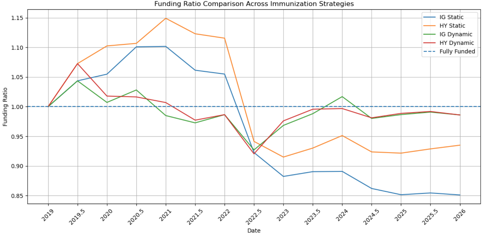

*Figure 13, report page 13. The original chart compares portfolio value divided by liability present value across four strategies. It is an illustration from the submitted report, not an independently reproduced backtest.*

[Read the report](reports/final-project-original.pdf) · [Excel model](models/portfolio-model-original.xlsx) · [Python data-retrieval notebook](notebooks/bloomberg-data-retrieval-original.ipynb) · [Bloomberg data workbook](data/bloomberg-index-data-2018-2025-original.xlsx)

---

## Project at a Glance

| Item | Scope |
|---|---|
| Objective | Explore portfolio construction around a future liability |
| Liability | $100 million due December 31, 2025 |
| Study window | December 31, 2018–December 31, 2025 |
| Credit comparison | Aaa long credit versus Baa long credit, both investment grade |
| Strategies | Static holdings and semiannual rebalancing |
| Measures examined | Portfolio duration, duration gap, surplus/shortfall, and funding ratio |
| Tools | Bloomberg, Excel, Python, pandas, xbbg, and Bloomberg API |
| Context | FRL 6460 academic team project |

The materials demonstrate data retrieval, spreadsheet portfolio modeling, and the analysis of interest-rate exposure relative to a liability. The Python notebook supplies the data-retrieval stage; the complete portfolio simulation and chart-generation code are not included in the supplied notebook.

## Background

A future payment creates two related portfolio questions: how much capital is needed today, and how sensitive should that capital be to changes in interest rates?

Duration-based immunization examines the relationship between asset value and liability present value, together with their interest-rate sensitivities. As time passes, the liability's remaining horizon declines. A portfolio constructed at inception may therefore drift away from its initial duration target.

This project investigates that problem using Treasury and credit indexes. The comparison is between **two investment-grade credit categories**, rather than investment-grade and speculative-grade debt. The original report's broader “high yield” framing has been corrected in this README. [Moody's credit-rating overview](https://www.moodys.com/web/en/us/solutions/ratings.html) provides the rating-category context.

## Analytical Approach

1. **Collect market inputs.** Retrieve Bloomberg index observations and organize them for analysis in Excel.
2. **Construct initial allocations.** Examine credit and Treasury weights against a seven-year liability horizon and a funding requirement.
3. **Compare management approaches.** Contrast retaining initial holdings with semiannual allocation adjustments.
4. **Evaluate liability tracking.** Examine duration gaps, portfolio value, surplus or shortfall, and funding ratios.
5. **Reconcile the implementation.** Check that weights, cash treatment, coupon units, liability valuation, and reported results use a consistent methodology.

The fifth step is still open. It is necessary before treating the report's comparisons as verified performance evidence.

---

## Portfolio Analysis

The images below were extracted directly from the PDF, without changing their plots or labels. In their original legends, **IG identifies the Aaa portfolio** and **HY identifies the Baa portfolio**. Full image provenance is recorded in [figure-sources.json](docs/figure-sources.json).

### Static Holdings: Duration Drift

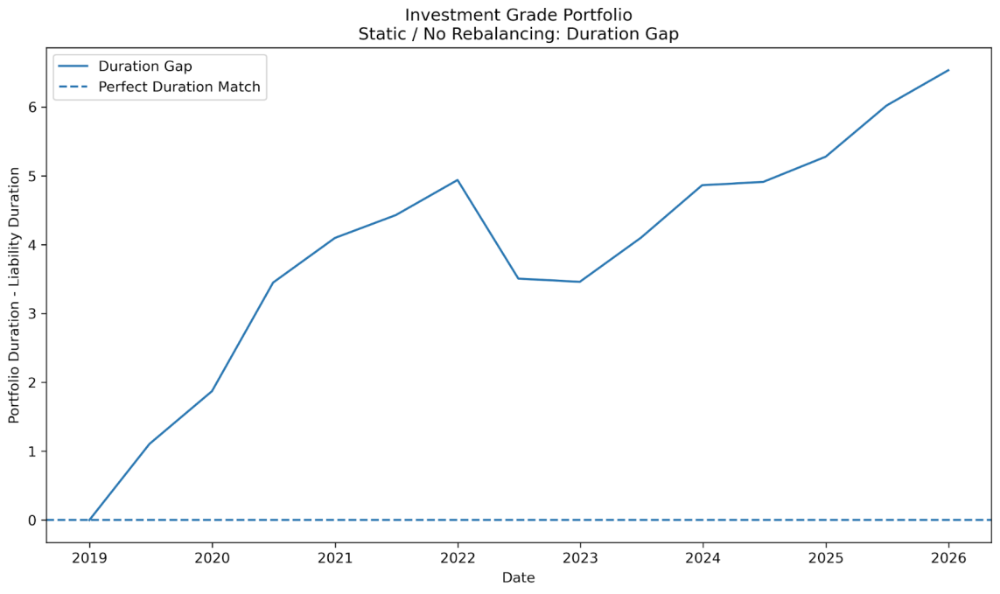

*Figure 1, page 6. The submitted chart shows the Aaa portfolio's duration gap increasing as the liability horizon shortens. The plotted series has not been independently regenerated.*

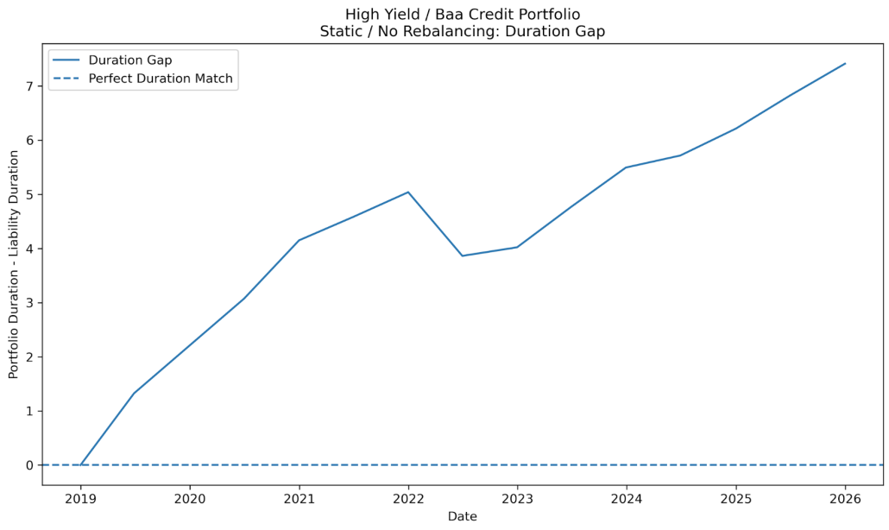

*Figure 2, page 7. The Baa comparison also shows a widening gap. The original “High Yield” title is a classification error.*

### Semiannual Rebalancing: Duration Alignment

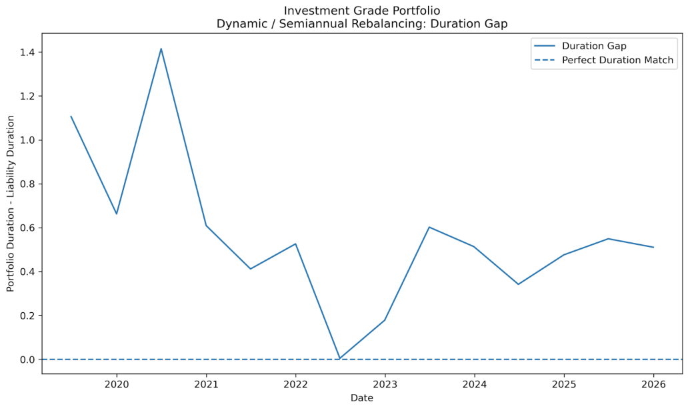

*Figure 7, page 10. The report presents a smaller duration gap under semiannual rebalancing. The workbook's inconsistent cash-duration treatment must be resolved before validating this comparison.*

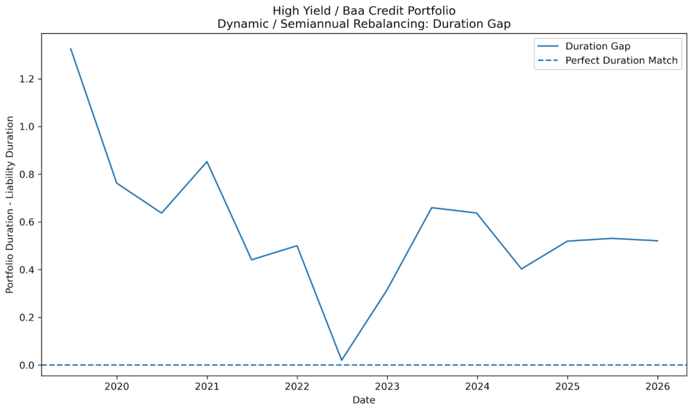

*Figure 8, page 10. Original Baa dynamic duration-gap series. This image is preserved as report evidence, with the same classification and reproducibility limitations.*

### Portfolio Value and Liability Tracking

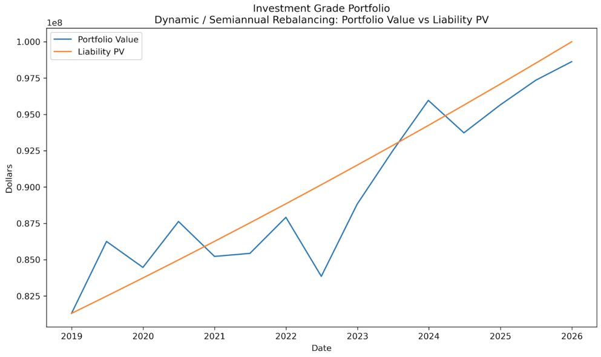

*Figure 12, page 12. The report compares the dynamically managed Aaa portfolio with liability present value. Reproducing this relationship requires a consistent liability discount method and portfolio valuation model.*

### Complete Figure Gallery

All remaining report images are included below. Expand to view them, or browse the [screenshots folder](screenshots/).

Static portfolio surplus and liability tracking — Figures 3–6

#### Figure 3 · Aaa Static Surplus / Shortfall · Page 7

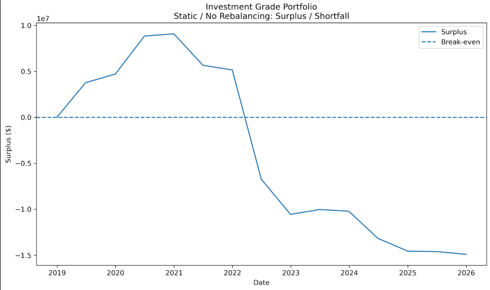

#### Figure 4 · Baa Static Surplus / Shortfall · Page 8

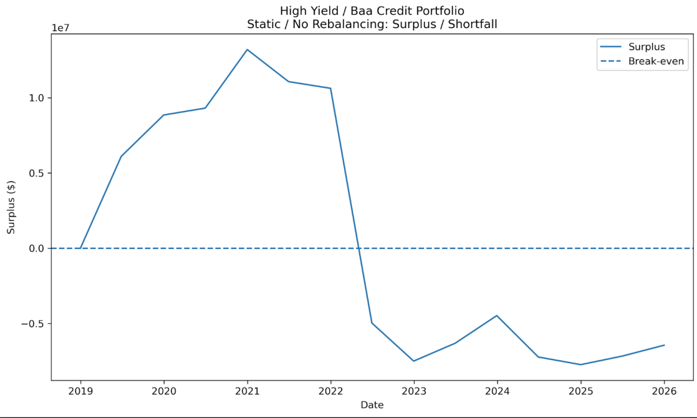

#### Figure 5 · Baa Static Liability Tracking · Page 8

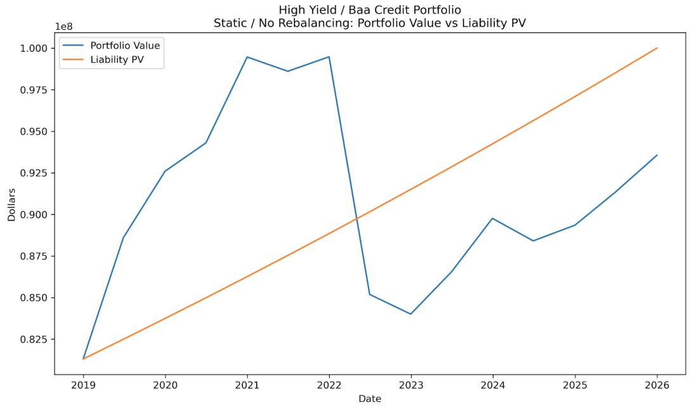

#### Figure 6 · Aaa Static Liability Tracking · Page 9

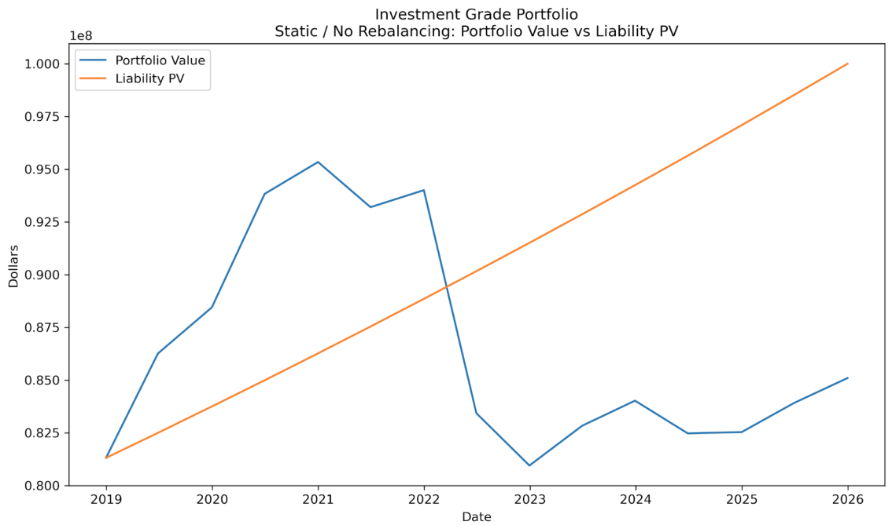

These are original report series; they are not outputs of a newly reconciled model.

Dynamic surplus, Baa liability tracking, and the reported funding summary

#### Figure 9 · Aaa Dynamic Surplus / Shortfall · Page 11

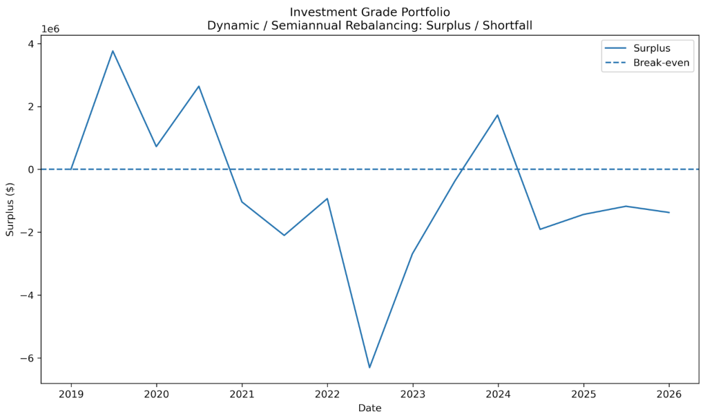

#### Figure 10 · Baa Dynamic Surplus / Shortfall · Page 11

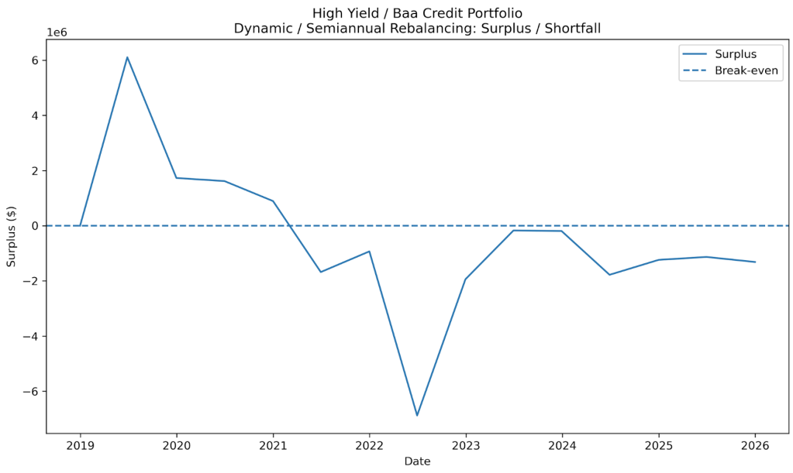

#### Figure 11 · Baa Dynamic Liability Tracking · Page 12

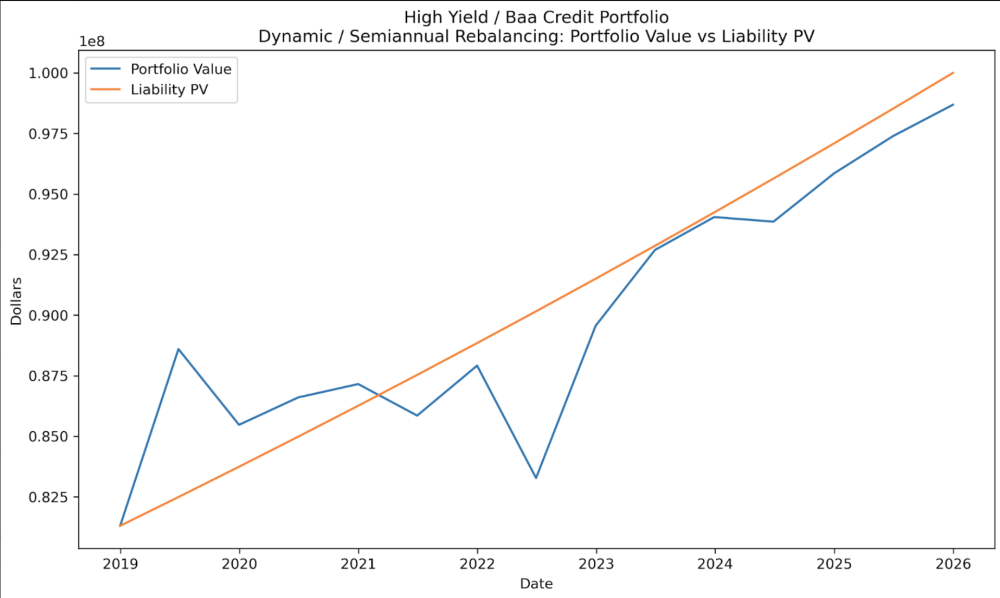

#### Original Funding-Ratio Summary · Page 13

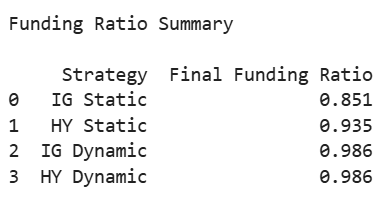

The report lists terminal ratios of 0.851 and 0.935 for the static portfolios and 0.986 for each dynamic portfolio. These do not currently reconcile to the supplied workbook's cash-flow totals. They are reproduced for transparency, not presented as validated results.

---

## Technical Implementation

### Bloomberg Data Retrieval

The supplied notebook connects to Bloomberg using `xbbg` and `blpapi`, converts responses into pandas tables, calculates index-level percentage changes, and exports tables to Excel.

| Series | Bloomberg identifier |
|---|---|
| Treasury 1–4 year | `I03840US Index` |
| Treasury 3–7 year | `LT13TRUU Index` |
| Treasury 3–10 year | `LT31TRUU Index` |
| Long credit Aaa | `I02787US Index` |
| Long credit Baa | `I02788US Index` |

These names and identifiers follow the supplied materials. The data workbook includes index levels, durations, and coupons. The notebook requests `PX_LAST` only and does not recreate all of those tables as supplied.

### Excel Portfolio Model

The workbook contains initial allocations, cash-flow exercises, and rebalancing schedules. The associated review traces specific formulas and proposes a consistent duration-matching policy. The original workbook is preserved so changes can be reviewed against the submitted work.

### Reproducibility

- The report and extracted images can be viewed without running Python.
- Running Bloomberg retrieval requires a compatible local Python environment and authorized Bloomberg Desktop API access. The notebook includes setup cells; it has not been executed as part of this review.
- Excel files can be downloaded for inspection. They are original working files, not corrected releases.
- Recreating the report figures requires the separate portfolio backtest and plotting code, which was not included in the supplied notebook.

## Review Findings and Improvements

| Finding | Required reconciliation |
|---|---|
| Baa is labeled high yield | Use Aaa/Baa investment-grade terminology throughout the report, workbook, and regenerated charts |
| One allocation sums to 101% | Solve weights that sum to 100% and meet the specified duration target |
| Cash contributes one year of duration on one side and zero on the other | Define one cash instrument and apply its duration consistently |
| Coupon formulas apply `%` to rates already stored as decimals | Correct units within a coherent cash-flow model |
| Initial positions allocate the future liability amount | Distinguish liability present value, starting capital, and surplus |
| Bond cash flows and total-return index assumptions are mixed | Select one consistent valuation and return methodology |
| Report outcomes do not tie to workbook totals | Reproduce the series and regenerate charts before making performance claims |

The [cell-level review](docs/deliverable-review.txt) includes examples, independent calculations, and proposed corrections. These proposals have **not** been applied to the original files. An index-level backtest must also avoid counting coupon income again when it is already reflected in total-return index performance.

## Project Materials

| File | Contents |
|---|---|
| [PDF report](reports/final-project-original.pdf) | Original team narrative and figures |
| [Excel model](models/portfolio-model-original.xlsx) | Original portfolio and cash-flow exercises |
| [Python notebook](notebooks/bloomberg-data-retrieval-original.ipynb) | Bloomberg retrieval, transformation, and export |
| [Data workbook](data/bloomberg-index-data-2018-2025-original.xlsx) | Supplied Bloomberg index observations |
| [Figure gallery](screenshots/) | 13 report charts and the funding-ratio summary image |
| [Review findings](docs/deliverable-review.txt) | Formula findings and reconciliation proposals |

## Team Credit

Prepared for FRL 6460 by **Noah Avina, Ana Lopez, Joshua Robles, and Andrew Pasten**. This repository presents the team project as part of Andrew Pasten's portfolio.

## Connect

[GitHub](https://github.com/Andrew-Pasten) · [LinkedIn](https://www.linkedin.com/in/andrewpastencpp/) · [Portfolio](https://andrew-pasten.github.io/Portfolio.io/index.html)
